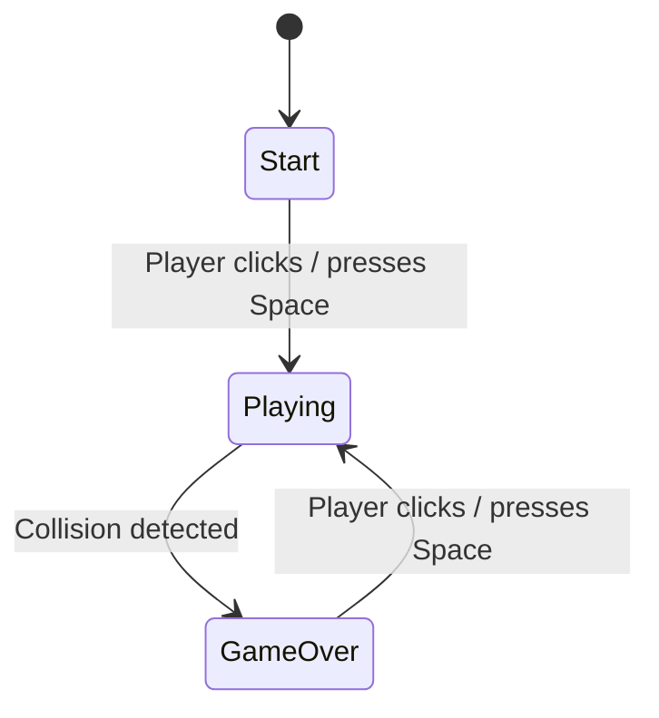
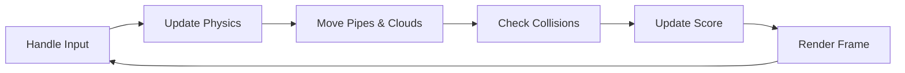

# Design Document: Flappy Kiro

## Overview

Flappy Kiro is a single-page browser game implemented entirely in one HTML file with embedded CSS and JavaScript. The game uses the HTML5 Canvas API for all rendering and runs a `requestAnimationFrame`-based game loop. The player controls a ghost character (Kiro) that must navigate through gaps between scrolling green pipe obstacles. The game tracks score and persists high scores via `localStorage`.

The architecture follows a straightforward game loop pattern: capture input → update state → render frame. All game objects (Kiro, pipes, clouds, ground) are plain JavaScript objects managed by a central game state. There are no external frameworks or build tools.

## Architecture



The game operates as a finite state machine with three states:

| State      | Description                                                                 |
|------------|-----------------------------------------------------------------------------|
| `start`    | Initial screen. Kiro is visible, clouds drift, waiting for player input.    |
| `playing`  | Game loop active. Gravity, pipes, scoring, collision detection all running. |
| `gameOver` | Loop stopped. Game over message shown. Waiting for restart input.           |

### Game Loop (Playing State)



Each frame:
1. Process any queued input (jump)
2. Apply gravity to Kiro's velocity, update position
3. Move pipes left, move clouds at parallax speeds
4. Check Kiro vs. pipes and Kiro vs. ground collisions
5. Check if Kiro passed a pipe pair, increment score
6. Clear canvas and redraw all elements

## Components and Interfaces

The game is organized into logical modules within a single script. No classes are strictly required — plain functions and object literals suffice.

### 1. Game State Manager

Holds the central mutable state:

```
gameState = {
  status: 'start' | 'playing' | 'gameOver',
  score: number,
  highScore: number,
  kiro: KiroState,
  pipes: PipeState[],
  clouds: CloudState[],
  frameCount: number
}
```

Functions:
- `resetGame()` — resets score, repositions Kiro, clears pipes, sets status to `playing`
- `loadHighScore()` — reads from `localStorage`
- `saveHighScore()` — writes to `localStorage`

### 2. Input Handler

Listens for `click`, `keydown` (Space), and `touchstart` events on the canvas/document.

- In `start` state: transitions to `playing`
- In `playing` state: sets Kiro's velocity to jump value, plays `jump.wav`
- In `gameOver` state: calls `resetGame()`, transitions to `playing`

### 3. Physics Engine

- `updateKiro(kiro, dt)` — applies gravity to velocity, updates y-position, clamps to canvas top
- Uses `CONFIG.gravity` (acceleration per frame)
- Uses `CONFIG.jumpVelocity` (negative y velocity on jump)

### 4. Pipe Manager

- `spawnPipe()` — creates a new PipeState with randomized gap position, using `CONFIG.canvas.width`, `CONFIG.canvas.height`, `CONFIG.pipe.gap`, and `CONFIG.pipe.width`
- `updatePipes(pipes)` — moves all pipes left by `CONFIG.pipe.speed`, removes off-screen pipes
- `checkPipePass(kiro, pipes)` — detects when Kiro crosses a pipe's x-position, returns count of newly passed pipes

### 5. Cloud Manager

- `initClouds()` — generates initial cloud set using `CONFIG.cloud.count`, `CONFIG.canvas.width`, `CONFIG.canvas.height`, `CONFIG.cloud.minOpacity`, `CONFIG.cloud.maxOpacity`, `CONFIG.cloud.minSpeed`, and `CONFIG.cloud.maxSpeed`
- `updateClouds(clouds)` — moves clouds left at individual speeds, wraps around when off-screen using `CONFIG.canvas.width`

### 6. Collision Detector

- `checkCollision(kiro, pipes)` — returns `true` if Kiro's bounding box overlaps any pipe rectangle or the ground line (ground y derived from `CONFIG.canvas.height - CONFIG.ground.height`)

### 7. Renderer

- `render(ctx, gameState, assets)` — master render function that clears canvas and draws all layers in order:
  1. Sky background (solid fill)
  2. Clouds (semi-transparent ellipses)
  3. Pipes (green rectangles)
  4. Ground (dark rectangle)
  5. Kiro (sprite image)
  6. HUD (score text)
  7. Overlay messages (start prompt or game over message)

### 8. Audio Manager

- `playSound(audioElement)` — rewinds and plays a sound effect
- Preloads `jump.wav` and `game_over.wav` as `Audio` objects

## Data Models

### KiroState

| Field      | Type   | Description                                      |
|------------|--------|--------------------------------------------------|
| `x`        | number | Horizontal position (constant during gameplay)   |
| `y`        | number | Vertical position (updated by physics)           |
| `width`    | number | Sprite width for collision box                   |
| `height`   | number | Sprite height for collision box                  |
| `velocity` | number | Current vertical velocity (positive = downward)  |

### PipeState

| Field    | Type    | Description                                        |
|----------|---------|----------------------------------------------------|
| `x`      | number  | Horizontal position of the pipe pair               |
| `gapY`   | number  | Y-coordinate of the center of the gap              |
| `gapSize`| number  | Vertical size of the gap opening                   |
| `width`  | number  | Width of each pipe column                          |
| `passed` | boolean | Whether Kiro has already passed this pipe pair     |

### CloudState

| Field     | Type   | Description                                       |
|-----------|--------|---------------------------------------------------|
| `x`       | number | Horizontal position                               |
| `y`       | number | Vertical position                                 |
| `width`   | number | Cloud width                                       |
| `height`  | number | Cloud height                                      |
| `opacity` | number | Transparency (0–1). Higher = closer/faster        |
| `speed`   | number | Horizontal scroll speed (derived from opacity)    |

### CONFIG Object

All game constants are consolidated into a single nested `CONFIG` object at the top of the script for easy tuning:

```js
const CONFIG = {
  canvas: { width: 480, height: 640 },
  gravity: 0.5,
  jumpVelocity: -8,
  pipe: { speed: 2.5, gap: 140, width: 52, interval: 90 },
  ground: { height: 80 },
  kiro: { x: 80 },
  cloud: { count: 6, minOpacity: 0.2, maxOpacity: 0.7, minSpeed: 0.3, maxSpeed: 1.5 }
};
```

| Path                    | Value | Description                              |
|-------------------------|-------|------------------------------------------|
| `CONFIG.canvas.width`   | 480   | Canvas width in pixels                   |
| `CONFIG.canvas.height`  | 640   | Canvas height in pixels                  |
| `CONFIG.gravity`        | 0.5   | Downward acceleration per frame          |
| `CONFIG.jumpVelocity`   | -8    | Upward velocity applied on jump          |
| `CONFIG.pipe.speed`     | 2.5   | Horizontal speed of pipes (px/frame)     |
| `CONFIG.pipe.gap`       | 140   | Vertical gap size between pipe pairs     |
| `CONFIG.pipe.width`     | 52    | Width of each pipe                       |
| `CONFIG.pipe.interval`  | 90    | Frames between pipe spawns               |
| `CONFIG.ground.height`  | 80    | Height of the ground strip               |
| `CONFIG.kiro.x`         | 80    | Kiro's fixed horizontal position         |
| `CONFIG.cloud.count`    | 6     | Number of background clouds              |
| `CONFIG.cloud.minOpacity` | 0.2 | Minimum cloud opacity                    |
| `CONFIG.cloud.maxOpacity` | 0.7 | Maximum cloud opacity                    |
| `CONFIG.cloud.minSpeed` | 0.3   | Minimum cloud scroll speed               |
| `CONFIG.cloud.maxSpeed` | 1.5   | Maximum cloud scroll speed               |

> **Dev note:** During development, `CONFIG` can be exposed on `window.CONFIG` so that values can be tweaked live from the browser console (e.g., `CONFIG.gravity = 0.3`) without reloading the page.

### LocalStorage Schema

| Key               | Type   | Description                              |
|-------------------|--------|------------------------------------------|
| `flappyKiroHigh`  | string | Stringified integer of the high score    |


## Correctness Properties

*A property is a characteristic or behavior that should hold true across all valid executions of a system — essentially, a formal statement about what the system should do. Properties serve as the bridge between human-readable specifications and machine-verifiable correctness guarantees.*

### Property 1: Jump sets upward velocity

*For any* Kiro state during the `playing` phase with any current velocity, applying a jump should set Kiro's velocity to exactly `CONFIG.jumpVelocity` (a negative value representing upward movement).

**Validates: Requirements 2.1**

### Property 2: Gravity accumulates downward velocity

*For any* Kiro velocity value, after one physics update step, the new velocity should equal the old velocity plus `CONFIG.gravity`.

**Validates: Requirements 2.3**

### Property 3: Kiro is clamped to canvas top

*For any* Kiro state after any physics update (including jumps with extreme negative velocities), Kiro's y-position should be greater than or equal to 0.

**Validates: Requirements 2.4**

### Property 4: Pipe generation produces valid gaps

*For any* spawned pipe pair, the gap center and gap size must satisfy two invariants: (a) the gap size equals `CONFIG.pipe.gap`, and (b) the gap is fully within the playable area (top of gap >= 0 and bottom of gap <= `CONFIG.canvas.height - CONFIG.ground.height`).

**Validates: Requirements 3.3, 3.4**

### Property 5: Pipes move left at constant speed

*For any* array of pipes, after one update step, each pipe's x-position should equal its previous x-position minus `CONFIG.pipe.speed`.

**Validates: Requirements 3.1, 8.2**

### Property 6: Off-screen pipes are removed

*For any* array of pipes after an update step, no pipe in the resulting array should have its right edge (x + width) less than 0.

**Validates: Requirements 3.5**

### Property 7: Collision detection correctness

*For any* Kiro bounding box and set of pipe rectangles and a ground y-coordinate, `checkCollision` should return `true` if and only if Kiro's bounding box overlaps at least one pipe rectangle or Kiro's bottom edge meets or exceeds the ground y-coordinate.

**Validates: Requirements 4.1, 4.2**

### Property 8: Score increments on pipe pass

*For any* Kiro x-position and pipe pair where Kiro's x exceeds the pipe's right edge and the pipe has not been marked as passed, calling the pass-check function should increment the score by exactly 1 and mark the pipe as passed.

**Validates: Requirements 5.1**

### Property 9: Score display format

*For any* pair of non-negative integers (score, highScore), the formatted score string should equal `"Score: {score} | High: {highScore}"`.

**Validates: Requirements 5.2**

### Property 10: High score is monotonically non-decreasing

*For any* current score and current high score, after the high-score update logic runs, the resulting high score should equal `max(score, highScore)`.

**Validates: Requirements 5.3**

### Property 11: High score persistence round trip

*For any* non-negative integer high score value, saving it to localStorage and then loading it back should produce the same integer value.

**Validates: Requirements 5.4**

### Property 12: Game reset produces clean initial state

*For any* game state in the `gameOver` status (with arbitrary score, pipe array, and Kiro position), calling `resetGame` should produce a state where: score is 0, Kiro is at the default starting position, the pipes array is empty, and status is `playing`.

**Validates: Requirements 6.4**

### Property 13: Cloud parallax — opacity correlates with speed

*For any* two clouds in the cloud array, if cloud A has a strictly higher opacity than cloud B, then cloud A's speed must be strictly greater than cloud B's speed. Additionally, all cloud opacities must be in the range (0, 1).

**Validates: Requirements 7.2, 7.3, 8.1**

### Property 14: Cloud wrapping prevents off-screen drift

*For any* cloud array after an update step, every cloud's x-position should be greater than or equal to negative cloud width (i.e., clouds that scroll off the left edge are repositioned to the right side of the canvas).

**Validates: Requirements 8.3**

## Error Handling

Since this is a single-page browser game with no server interaction, error handling is minimal:

- **Asset loading failure**: If `ghosty.png` or audio files fail to load, the game should still render (fallback to a colored rectangle for Kiro, silent gameplay). Use `onerror` handlers on `Image` and `Audio` objects.
- **localStorage unavailable**: Wrap `localStorage.getItem` / `setItem` in try-catch. If unavailable (e.g., private browsing), high score simply won't persist across sessions. Default high score to 0.
- **Canvas not supported**: Display a fallback message in the HTML if `canvas.getContext('2d')` returns null.
- **Invalid stored data**: When reading high score from localStorage, parse with `parseInt` and fall back to 0 if the result is `NaN`.

## Testing Strategy

### Unit Tests

Unit tests cover specific examples, edge cases, and integration points:

- Kiro starts at the correct default position (Req 1.2)
- Initial game state is `start` (Req 1.4)
- Collision triggers `gameOver` state transition (Req 4.3)
- Game over saves high score to localStorage (Req 6.3)
- Game over sets status to `gameOver` (Req 6.2)
- Edge case: Kiro at exact ground boundary triggers collision
- Edge case: Kiro at exact pipe edge triggers collision
- Edge case: Score of 0 formats correctly
- Edge case: localStorage returns null (first visit)

### Property-Based Tests

Property-based tests validate universal correctness properties using generated inputs. Use **fast-check** as the property-based testing library (JavaScript).

Configuration:
- Minimum 100 iterations per property test
- Each test tagged with its design property reference

| Test | Tag | Property |
|------|-----|----------|
| Jump velocity | Feature: flappy-kiro, Property 1: Jump sets upward velocity | For any Kiro state, jump sets velocity to CONFIG.jumpVelocity |
| Gravity | Feature: flappy-kiro, Property 2: Gravity accumulates downward velocity | For any velocity, update adds CONFIG.gravity |
| Canvas clamp | Feature: flappy-kiro, Property 3: Kiro is clamped to canvas top | For any state after update, y >= 0 |
| Pipe gaps | Feature: flappy-kiro, Property 4: Pipe generation produces valid gaps | For any spawned pipe, gap is valid and consistent |
| Pipe movement | Feature: flappy-kiro, Property 5: Pipes move left at constant speed | For any pipes, update decreases x by CONFIG.pipe.speed |
| Pipe cleanup | Feature: flappy-kiro, Property 6: Off-screen pipes are removed | For any pipes after update, none off-screen |
| Collision | Feature: flappy-kiro, Property 7: Collision detection correctness | For any Kiro + pipes + ground, collision iff overlap |
| Scoring | Feature: flappy-kiro, Property 8: Score increments on pipe pass | For any passed pipe, score increments by 1 |
| Score format | Feature: flappy-kiro, Property 9: Score display format | For any (score, high), format matches template |
| High score | Feature: flappy-kiro, Property 10: High score is monotonically non-decreasing | For any (score, high), result is max |
| Persistence | Feature: flappy-kiro, Property 11: High score persistence round trip | For any int, save then load returns same value |
| Reset | Feature: flappy-kiro, Property 12: Game reset produces clean initial state | For any gameOver state, reset produces clean state |
| Parallax | Feature: flappy-kiro, Property 13: Cloud parallax — opacity correlates with speed | For any two clouds, higher opacity implies higher speed |
| Cloud wrap | Feature: flappy-kiro, Property 14: Cloud wrapping prevents off-screen drift | For any clouds after update, all within bounds |

### Test Approach

- Both unit tests and property-based tests are complementary and required
- Unit tests catch specific concrete bugs and verify edge cases
- Property tests verify general correctness across randomized inputs
- Each correctness property above maps to exactly one property-based test
- Tests run via a simple HTML test runner or Node.js with fast-check
