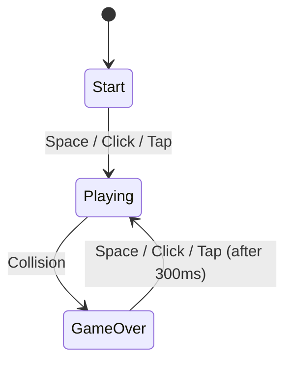
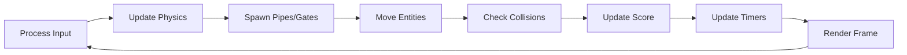
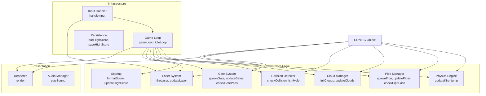
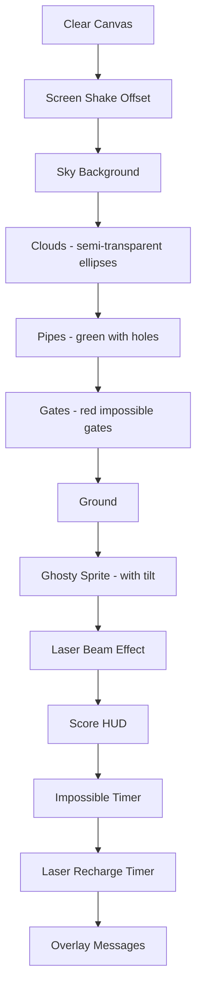
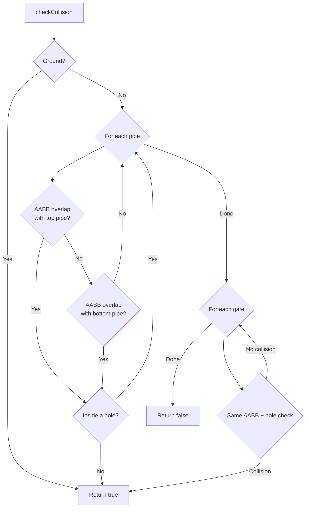
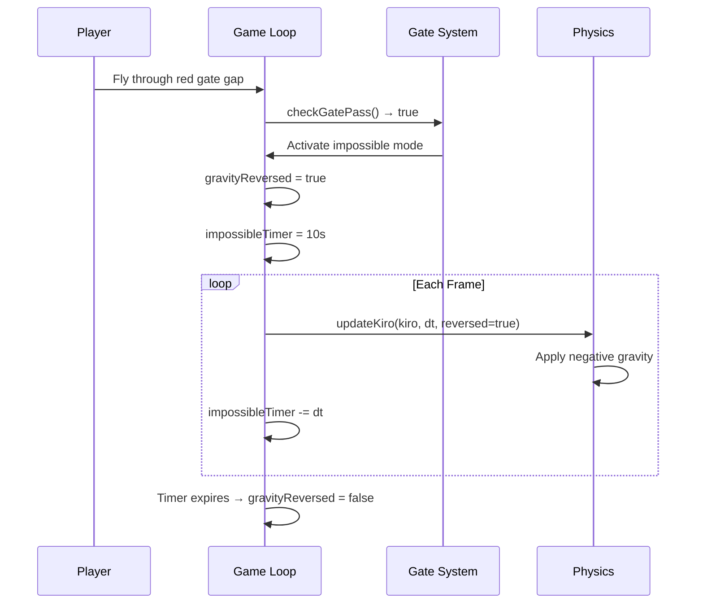
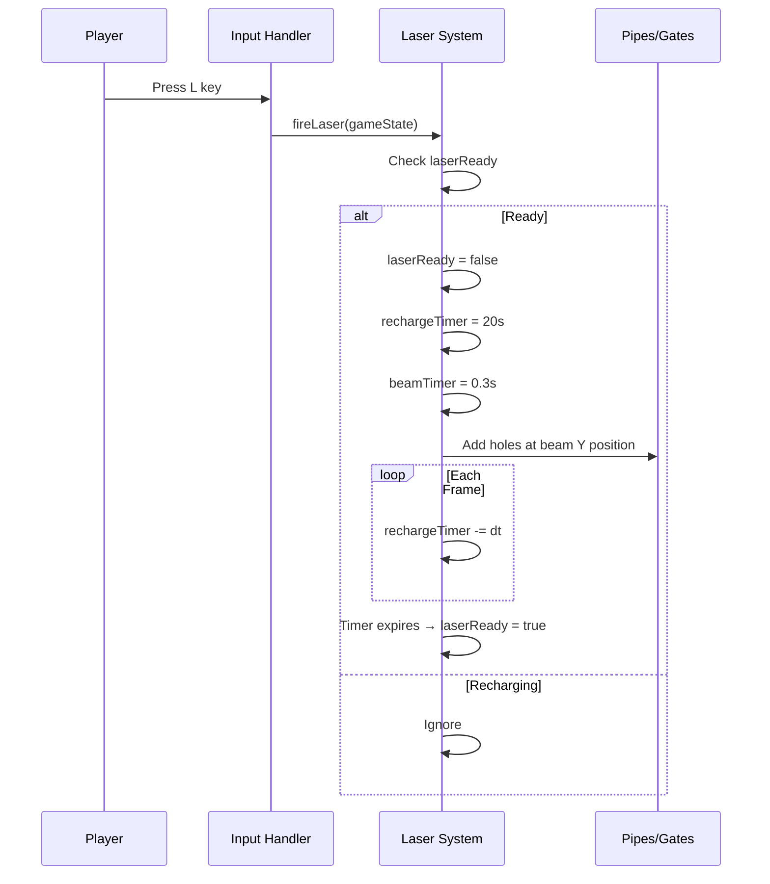

# Flappy Kiro

A retro browser-based endless side-scroller game where you guide Ghosty the ghost through green pipes, red impossible gates, and blast obstacles with a laser. Built as a single HTML file with vanilla JavaScript and the HTML5 Canvas API.


## How to Play

1. Open `index.html` in a browser (or serve via `python -m http.server 8080`)
2. Click, tap, or press **Space** to start and jump
3. Press **L** to fire the laser (20s recharge)
4. Navigate through pipe gaps to score points
5. Fly through **red gates** to activate Impossible Mode (reversed gravity for 10s)

## Controls

| Input | Action |
|-------|--------|
| Space / Click / Tap | Jump (or start/restart) |
| L | Fire laser |

## Features

- Gravity-based physics with delta-time integration
- Parallax cloud layers with varying opacity and speed
- Green pipes with two-tone rendering and caps
- Red impossible gates that reverse gravity for 10 seconds
- Laser beam that blasts holes through pipes
- Score and high score persistence via localStorage
- Screen shake on collision
- Velocity-based Ghosty tilt animation
- Idle bob animation on start screen
- Touch support for mobile

## Architecture

### Game State Machine



### Game Loop (Playing State)



### System Modules



### Render Pipeline



### Collision Detection Flow



### Impossible Mode Flow



### Laser System Flow



## Project Structure

```
├── index.html          # Single-file game (HTML + CSS + JS)
├── game-config.json    # Physics parameters reference
├── assets/
│   ├── ghosty.png      # Ghost character sprite
│   ├── jump.wav        # Jump sound effect
│   └── game_over.wav   # Game over sound effect
├── img/
│   └── example-ui.png  # Screenshot
└── .kiro/
    ├── specs/flappy-kiro/
    │   ├── requirements.md
    │   ├── design.md
    │   └── tasks.md
    └── steering/
        ├── game-coding-standards.md
        ├── game-architecture.md
        ├── game-mechanics.md
        ├── canvas-and-collision.md
        └── visual-design.md
```

## CONFIG Object

All tunable constants live in a single `CONFIG` object exposed on `window.CONFIG` for live console tweaking:

| Path | Default | Description |
|------|---------|-------------|
| `gravity` | 800 | Downward acceleration (px/s²) |
| `jumpVelocity` | -300 | Upward velocity on jump (px/s) |
| `pipe.speed` | 120 | Horizontal pipe speed (px/s) |
| `pipe.gap` | 140 | Vertical gap between pipes (px) |
| `wall.spacing` | 350 | Distance between pipe spawns (px) |
| `impossible.duration` | 10 | Reversed gravity duration (s) |
| `laser.rechargeTime` | 20 | Laser cooldown (s) |
| `laser.holeSize` | 60 | Size of laser holes (px) |

## Credits

Created by DD. Built with [Kiro](https://kiro.dev).

## License

See [LICENCE.md](LICENCE.md).
